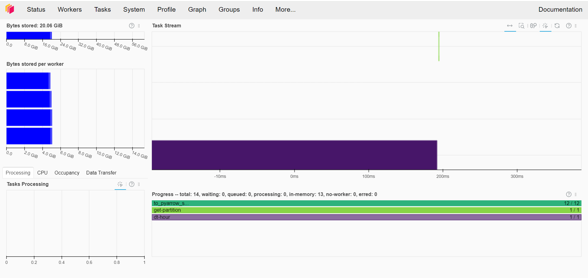

# Final Project README


UrbanInsight: Crime Dynamics and Spatial Analysis
=

## Introduction

Welcome to my final project README! 

The project focuses on analyzing crime data from the [Chicago Data Portal](https://data.cityofchicago.org/Public-Safety/Crimes-2001-to-Present/ijzp-q8t2/about_data) to understand patterns and trends over time. By leveraging large-scale computing strategies, I aim to process, analyze, and visualize this data to provide insights into crime dynamics in the city.

### A Social Science Problem

## Introduction

The project is driven by the pressing need to address crime and safety concerns within urban communities. According to FBI [Uniform Crime Reporting (UCR) Program](https://cde.ucr.cjis.gov/LATEST/webapp/#/pages/explorer/crime/crime-trend), in 2022, there were 1,954.4 property crimes per 100,000 people and 380.7 violent crimes per 100,000 people, underscoring the importance of implementing effective crime prevention strategies.

To gain deeper insights into the dynamics of crime and its contributing factors, I started to explore publicly available crime data, [Chicago Data Portal](https://data.cityofchicago.org/Public-Safety/Crimes-2001-to-Present/ijzp-q8t2/about_data), to identify key patterns and trends in crime data, with a focus on understanding the underlying factors driving criminal activities within the state of Illinois. Utilizing advanced analytical techniques such as spatial analysis, temporal analysis, and predictive modeling, I aim to uncover correlations between various socio-economic indicators, environmental factors, and crime rates. By examining the spatial distribution of crime hotspots and conducting trend analysis over time, the areas of concern and potential interventions for crime prevention can be identified.

Understanding crime patterns is crucial for urban planning, law enforcement, and public safety initiatives. However, traditional data analysis methods, including desktop applications and programming languages like Python, fall short when dealing with large datasets. From my personal experiences, it takes a long time to query data manually download from the data portal website, especially with the operations of filtering and grouping by. When analyzing and visualizing, it's slow in loading and rendering. Moreover, crime reports are updated daily with significant volumes of data and the crime dataset on Chicago Data Portal has around 300k entries per year with over 20 columns. A systematic pipeline of data query, retrieve, storage and analysis is thus needed. Analyzing large datasets, especially those involving spatial analysis and visualization with maps, is resource-intensive and time-consuming, requiring powerful CPUs and an efficient allocation of computational tasks. Hence, scalable computing methods are essential to efficiently process and analyze such data to derive actionable insights. This project can serve as an example that how researchers can employ cloud computing resources in large-scale spatial analysis.


### Description of Methods

A series of steps are employed to tackle this problem:


1. **Data Collection** [data_query_store.ipynb](crime_map/data_query_store.ipynb): query crime data from the Chicago Data Portal using its API. This step is parallelized by querying data entries partioned by time. As show below, 12 batches are generated for each month and each of the bacth is a list of lists of dictionaries with the ```where_clause``` parameter to be added into the data query request with API. The step function then triggers the lambda function to request data from Chicago Data Portal according to the request specified. More details about the usage of the API can be found here: [Chicago Crime Report API Documentaion](https://dev.socrata.com/foundry/data.cityofchicago.org/ijzp-q8t2)
  ```
# generate events to query crime reports in 2023 in parallel
def generate_where_clause(start_date, end_date):
    where_clause = f"date between '{start_date.strftime('%Y-%m-%dT%H:%M:%S.000')}' and '{end_date.strftime('%Y-%m-%dT%H:%M:%S.000')}'"
    return where_clause
m = 12
wheres_by_months = [[{'where': generate_where_clause(datetime(2023, m+1, j), datetime(2023, m+1, j+1))} for j in range(1,28)] for m in range(12)]
n = 9
wheres_batches = [[wheres_by_months[m][i:i + n] for i in range(0, len(wheres_by_months), n)] for m in range(12)]
```

2. **Data Storage** [data_query_store.ipynb](crime_map/data_query_store.ipynb): send and store the retrieved data in a MySQL table hosted on Amazon RDS (Relational Database Service) and also store it in an S3 bucket for backup and further analysis. The two types of data storages can effectively address the diverse requirements of the project. MySQL facilitates efficient querying and relational data analysis, while S3, saving each entry as an object in JSON file, provides scalable and durable storage for raw data, backups, and archival purposes. This architecture offers flexibility and resilience and makes it easire for me to retrieve data from MySQL table while ensure the raw data is secure throughout the analysis process.


3. **Data Processing** [data_visualization.ipynb](crime_map/data_visualization.ipynb): read the data into ```Dask``` dataframe. 4 EC Clusters are launched on AWS to perform this task. Then cleaned the data, performed labeling of crime types, and conducted time trend analysis. Dask allows parallelize computations and make the processing more efficient. 



4. **Data Visualization** [data_visualization.ipynb](crime_map/data_visualization.ipynb): visualize the processed data using maps to identify time trends and spatial patterns using holoviews with backend of ```matplotlib``` and ```bokeh```. It laods and renders the data much faster compared to plot solely with ```matplotlib``` and ```bokeh``` and efficiently reduced the time of visualization.


### Takeaways

1. All three stages of the project show a high potential of speeding up the spatial analysis. While the data query is limited by the number of concurrent workers for now and I ran multiple times of step functions to retrieve the data for following analysis, it takes much less time than both manually downloading and sequential queries. The data processing is improved, as there are multiple operations that can be efficiently parallized, such as labeling, parsing ```datetime``` data, etc. Lastly, the visualization is highly enhanced. It takes much less time to load the data and create the maps.

2. The time series analysis shows that, for example, theft is the most frequent crime type, and it has a spike in last summer and a drop around Christmas; it also have a obvious time pattern by hour, where we can see there a spike during midnight and a bulge in daytime.


4. In the spatial analysis, it can be seen that there's a high accumulation of crimes in Chicago city, some areas in the north side of Illinois and some in south side. This gives us a brief idea on where the crime hot spots tend to be. 


The second map with points classified by the type (violent vs non-violent) of crimes show that, while the city is more intensive in crimes in general, it tends to be less likely envolved in violent crimes.


### Future

This large scale computing setups will be able to highly increase the efficiency with more resources requested, especially given that only a cost of ~$15 has been spent so far for this project. More temporal and spatial analysis can be performed, such as spatial correlation analysis among neighborhoods or community areas, hotspot detection, crime prediction, and how the crime distribution in city or state level changes with time.

